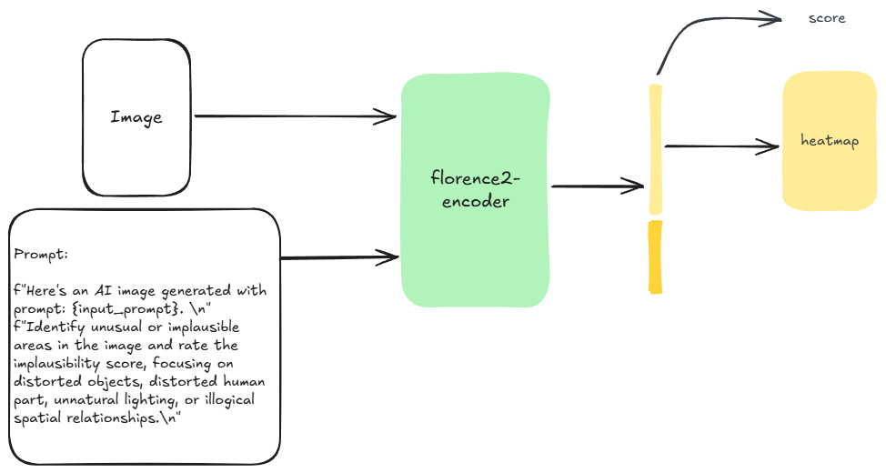

## AIGC Structural Distortion Detection and Assessment 

A straightforward Florence-2–based multi-task model for AIGC structural distortion detection and assessment, which achieved 2nd place in the AIGC Imagery Structural Distortion Detection track at NTIRE 2025.



### Environment Setup

```bash
# Create and activate the Conda environment
conda env create -f environment.yml
conda activate nitre2025
```

### Data Preparation

Notice: This repo was developed for the NTIRE2025 workshop (not for EvalMuse-40K) and may contain quite a bit of hardcodes. Please make the necessary modifications to adapt it to your own dataset.
```bash
export DATA_ROOT=/path/to/your/data
python code/data_process.py
```

### Training

```bash
# Configure Accelerate once before the first run
accelerate config
```

```bash
#!/usr/bin/env bash

export HF_ENDPOINT=https://hf-mirror.com

# ───────── Hyper-parameters ─────────
score_loss="mse-plcc-srcc"
mask_loss="dice-mse"
warmup_epoch=20
nproc_per_node=8
batch_size=4
batch_size_warmup=32
score_head="linear"
model="florence2"
mask_head="concat"
negative_num=0
val_split=0
lora_rank=0        # full fine-tuning
data_root=${DATA_ROOT}

# ───────── Experiment name ─────────
date=$(date +%Y%m%d)
exp_name="${date}_${model}_${mask_loss}_${score_loss}_lora${lora_rank}_${score_head}_${mask_head}_warmup${warmup_epoch}_gpu${nproc_per_node}"

mkdir -p ./exp/experiments/${exp_name}

# ───────── Launch training ─────────
accelerate launch train.py   \
--experiment_name   ${exp_name}    \
--lr 1e-4  --epoch 50 --batch_size ${batch_size} \
--batch_size_warmup ${batch_size_warmup} \
--accumulate_step   1 --val_iter -1 --save_iter 5\
--model ${model} --input_size 768 --mask_size 768 --val_split ${val_split} \
--mask_loss ${mask_loss} --score_loss ${score_loss} \
--fp16 --lora_rank ${lora_rank} --warmup_epoch ${warmup_epoch} \
--score_head ${score_head} --mask_head ${mask_head} --mode train \
--unfreeze_params all --negative_num ${negative_num} --data_path ${data_root} \
2>&1 | tee ./exp/experiments/${exp_name}/train.log
```

### Inference

```bash
model="20250320_florence2_dice-mse_mse-plcc-srcc_lora0_linear_concat_warmup5_gpu8"
CUDA_VISIBLE_DEVICES=4 python evaluate.py   "../checkpoints/${model}/config.yaml"   --load_checkpoint "../checkpoints/${model}/last.pth"
```