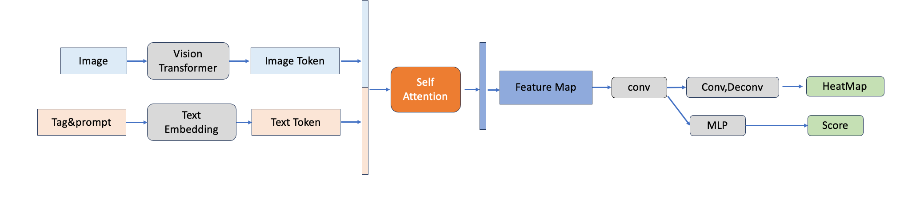
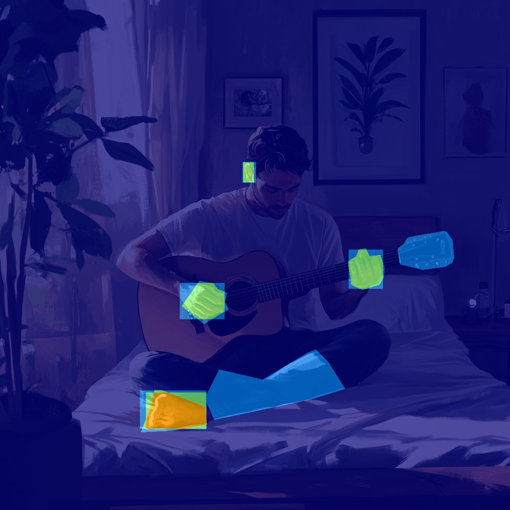

# EvalMuse-Structure
This repo is prepared for EvalMuse Part2-Structure Distortion Detection.
Baseline for ntire 2025 'Text to Image Generation Model Quality Assessment -Track2- Structure Distortion Detection' has been released.

# Framework
This baseline (EM-RAHF) is inspired by paper [Rich Human Feedback for Text-to-Image Generation](https://arxiv.org/pdf/2312.10240), since the authors of RAHF did not provide code, we modified some details of the original model and achieved better performance.The details of our methods will be published in a technical report paper.


# Train&Eval
We processed the bounding boxes in the annotation file into the format of heatmap to train baseline model following RAHF  
|  |  |
|-------------------------|-------------------------|  

You can process the training label into a baseline training file by executing the following script  
```bash
python data_process.py
```

Then you can train the baseline model by changing your own data path and training parameter settings, then run  
```bash
./run_train.sh  
```
note that we use the pretrained model [AltCLIP](https://huggingface.co/BAAI/AltCLIP) as vision and text encoder to achieve better performance.  
  
Evaluation and inference can be done by changing your own data path and model weight path, then run
```bash
python evaluate.py
```

# Baseline Results
We provide a Google Drive link for the baseline prediction result: [baseline result](https://drive.google.com/file/d/1dCnZqlSfWZbg-EVjKHefc8xuMdIlbbb1/view?usp=drive_link)  
The metrics score of the baseline is:

| Precision      | Recall      | F1-score      | PLCC      | SROCC      |Final-score      |
|--------------|--------------|--------------|--------------|--------------|--------------|
| 0.5086   | 0.6728   | 0.5793   | 0.6945   | 0.6677   |0.6098  |

# Citation and Acknowledgement

If you find EvalMuse or EM-RAHF useful for your research, please consider cite our paper:
```bibtex
@misc{han2024evalmuse40kreliablefinegrainedbenchmark,
      title={EvalMuse-40K: A Reliable and Fine-Grained Benchmark with Comprehensive Human Annotations for Text-to-Image Generation Model Evaluation}, 
      author={Shuhao Han and Haotian Fan and Jiachen Fu and Liang Li and Tao Li and Junhui Cui and Yunqiu Wang and Yang Tai and Jingwei Sun and Chunle Guo and Chongyi Li},
      year={2024},
      eprint={2412.18150},
      archivePrefix={arXiv},
      primaryClass={cs.CV},
      url={https://arxiv.org/abs/2412.18150}, 
}
```
For using baseline RAHF or dataset RichHF-18k, please consider cite the paper
```bibtex
@inproceedings{richhf,
  title={Rich Human Feedback for Text-to-Image Generation},
  author={Youwei Liang and Junfeng He and Gang Li and Peizhao Li and Arseniy Klimovskiy and Nicholas Carolan and Jiao Sun and Jordi Pont-Tuset and Sarah Young and Feng Yang and Junjie Ke and Krishnamurthy Dj Dvijotham and Katie Collins and Yiwen Luo and Yang Li and Kai J Kohlhoff and Deepak Ramachandran and Vidhya Navalpakkam},
  booktitle={Proceedings of the IEEE/CVF Conference on Computer Vision and Pattern Recognition},
  year={2024},
}
```
